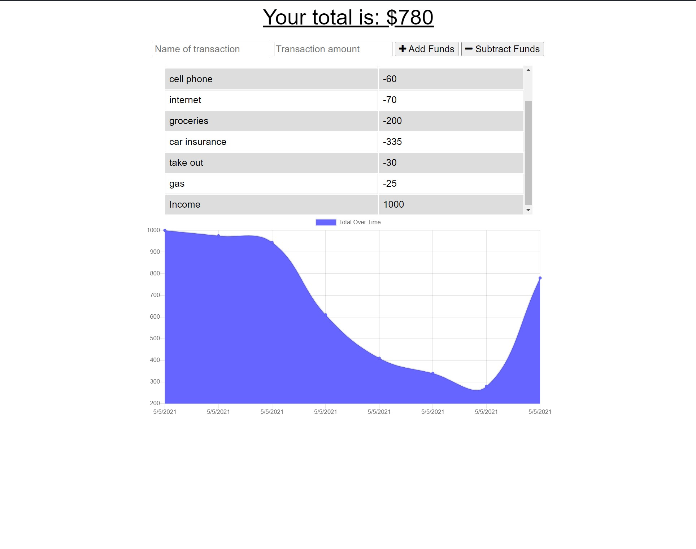

  
  # PWA Budget Tracker

  ## Description
  Use this budget tracker online OR offline to track your monthly budget. When the application detects an internet conenction it will automatically push up the new transactions to keep your budget up to date
  
  ## License Badge
  
  []
  
  ## Table of Contents
  
  - [Installation](#installation)
  - [Git Hub Repo](#git-hub-repo)
  - [Heroku Live Site](#heroku-live-app)
  - [License](#license)
  
  ## Installation
  
  Step 1: Run NPM Install to install locally OR use web app online
Step 2: If running locally use NPM run start to start the server file
Step 3: load in browser
  
  ## Git Hub Repo
  https://github.com/adamnatrop/pwa

  ## Heroku Live App
  https://radiant-fjord-75539.herokuapp.com/ 

  ## Screenshots

  

  ## License
  
  The Unlicense
  Review License terms at [http://unlicense.org/](http://unlicense.org/)
  
 
  